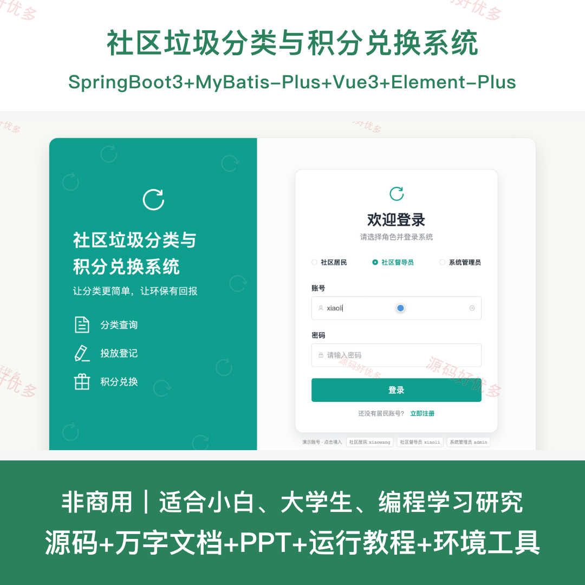
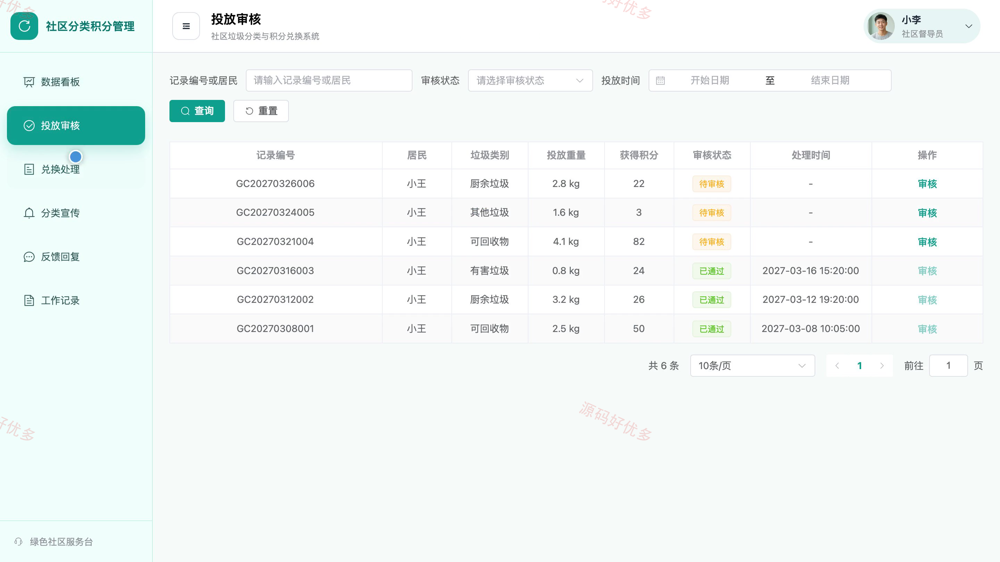
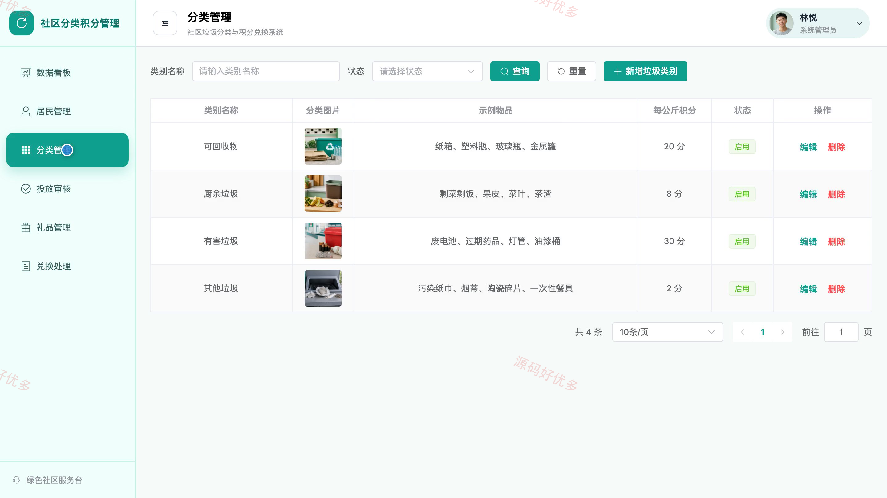
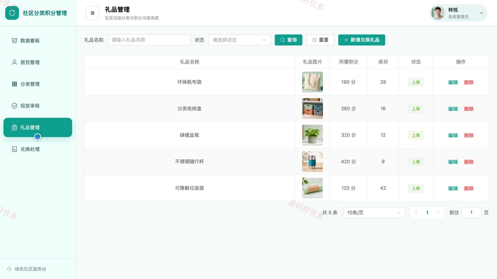

# bs101A
bs101A社区垃圾分类与积分兑换系统
## 源码问题查看主页咨询

### 一、关键词
垃圾分类、垃圾投放、社区环保、积分兑换、分类宣传

### 二、作品包含
源码+数据库+万字设计文档+PPT+全套环境和工具资源+本地部署教程

### 三、项目技术
前端技术： Html、Css、Js、Vue3.4、Element-Plus
后端技术：Java、SpringBoot3.2.0、MyBatis-Plus

### 四、运行环境（以下版本亲测，其他版本兼容性请自行测试）
开发工具：IDEA/eclipse + VSCODE

数据库：MySQL5.7+（共12张表）

数据库管理工具：Navicat10以上版本

环境配置软件： JDK17 + Maven

前端Nodejs：20.20.2

浏览器：谷歌浏览器

### 五、项目介绍
项目编号：bs101A

系统面向社区居民、社区督导员和系统管理员，围绕垃圾分类查询、居民投放登记、督导审核发放积分、礼品兑换与社区运营统计形成可追踪的业务闭环。居民可查询分类指南、登记投放、查看积分和兑换礼品；督导员负责投放审核、兑换处理、宣传维护与反馈回复；管理员统一维护账号、垃圾类别、礼品和全局业务数据。

角色：社区居民、社区督导员、系统管理员

社区居民功能：垃圾分类查询、投放登记、积分明细查看、礼品兑换、兑换订单查询、意见反馈、个人账号维护。

社区督导员功能：投放记录审核、积分发放、兑换申请处理、分类宣传管理、反馈回复、工作记录查询。

系统管理员功能：居民账号管理、垃圾类别管理、礼品信息管理、投放记录管理、兑换订单管理、全局数据统计。

### 六、运行截图

